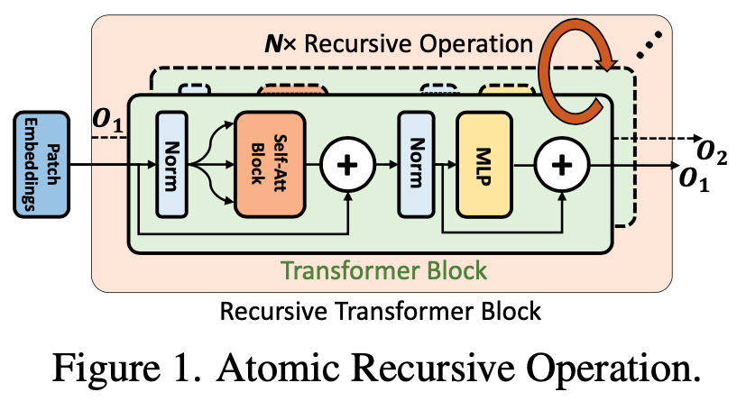
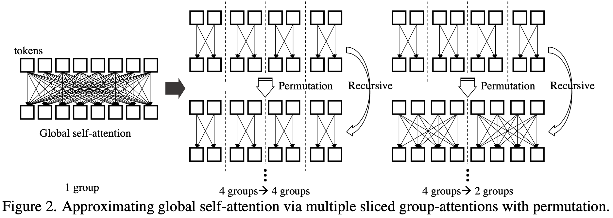

# Sliced Recursive Transformer (SReT)

Pytorch implementation of our paper: [Sliced Recursive Transformer](https://arxiv.org/abs/2111.05297), Zhiqiang Shen, Zechun Liu and Eric Xing, CMU and MBZUAI.
 
<div align=center>

</div>

<br>

<div align=center>

</div> 


### Abstract

We present a neat yet effective recursive operation on vision transformers that can improve parameter utilization without involving additional parameters. This is achieved by sharing weights across depth of transformer networks. The proposed method can obtain a substantial gain (about 2%) simply using naive recursive operation, requires no special or sophisticated knowledge for designing principles of networks, and introduces minimum computational overhead to the training procedure. To reduce the additional computation caused by recursive operation while maintaining the superior accuracy, we propose an approximating method through multiple sliced group self-attentions across recursive layers which can reduce the cost consumption by 10~30% with minimal performance loss. We call our model Sliced Recursive Transformer (SReT), which is compatible with a broad range of other designs for efficient vision transformers. Our best model establishes significant improvement on ImageNet-1K over state-of-the-art methods while containing fewer parameters.


## SReT Models

Install `timm` using:

```
pip install git+https://github.com/rwightman/pytorch-image-models.git
```

Create SReT models:

```Python
import torch
import SReT

model = SReT.SReT_S(pretrained=False)
print(model(torch.randn(1, 3, 224, 224)))
...
```

Load pre-trained SReT models:

```Python
import torch
import SReT

model = SReT.SReT_S(pretrained=False)
model.load_state_dict(torch.load('./pre-trained/SReT_S.pth')['model'])
print(model(torch.randn(1, 3, 224, 224)))
...
```

Train SReT models with knowledge distillation (recommend to train with [FKD](https://github.com/szq0214/FKD)):

```Python
import torch
import 
import SReT
import kd_loss

criterion_kd = kd_loss.KDLoss()

model = SReT.SReT_S_distill(pretrained=False)
student_outputs = model(images)
...
# we use the soft label only for distillation procedure as MEAL V2
# Note that 'student_outputs' and 'teacher_outputs' are logits before softmax
loss = criterion_kd(student_outputs/T, teacher_outputs/T)
...
```

##Pre-trained Model

We currently provide the last epoch checkpoints and will add the best ones together with more models soon. (⋇ indicates without slice.)

| Model   |  FLOPs |  #params  | accuracy  | weights (last) |weights (best) |logs |configurations |
|:-------:|:--------:|:--------:|:--------:|:--------:|:--------:|:--------:|:--------:|
| `SReT_⋇T` |  1.4G |4.8M |  76.1 | [link](https://drive.google.com/file/d/1wHM7NRSkz-WykCSES17xFV56h_m5RMXj/view?usp=sharing) |[TBA]() |[link](https://drive.google.com/file/d/1yF-tymzI76V3xevRE_4sr6INW0szTwZx/view?usp=sharing) |[link](https://drive.google.com/file/d/1WnhQPbfRrC3AwNksZK8I5PQ0ipL1nrEj/view?usp=sharing) |
| `SReT_T`  |  1.1G |4.8M |  76.0 | [link](https://drive.google.com/file/d/1FDTpva6y-I_bKmyVmLFDn_3BlDq3dwni/view?usp=sharing) |[TBA]() |[link](https://drive.google.com/file/d/1vcvFrd8KCP_-FoG1a3YawT49VdTyIL-_/view?usp=sharing) |[link](https://drive.google.com/file/d/1vtv7DLKshJWd1DjYL-8rw-ATuoaIm_h6/view?usp=sharing) |
| `SReT_⋇LT`|  1.4G |5.0M |  76.8 | [link]() |[TBA]() |[link]() |[link]() |
| `SReT_LT [16-14-1,1-1-1]` |  1.2 G |5.0M |  76.6 | [link](https://drive.google.com/file/d/1sKW9KJ5PLkDVXcW6m7dp8ieLwyCJNRqV/view?usp=sharing) |[TBA]() |[link](https://drive.google.com/file/d/1CdKWwaB6U_2fR7WcZdC-ai9jZqyPOSTA/view?usp=sharing) |[link](https://drive.google.com/file/d/18_Bm9rQbpkZW8w2LiUk8-p7MFgIwgeH6/view?usp=sharing) |
| `SReT_⋇S` |  4.7G |20.9M |  82.0 | [link](https://drive.google.com/file/d/1vlsxJieKhfnw-F6xFiwczvXBuk7ugXxm/view?usp=sharing) |[TBA]() |[link](https://drive.google.com/file/d/1qD0wlLEsLiNqmSutfkZlRo5IpXDdC9fY/view?usp=sharing) |[link](https://drive.google.com/file/d/16iXf5Pn4PjSrP_rdLNjvOxECa9wCEBEi/view?usp=sharing) |
| `SReT_S`  |  4.2G | 20.9M| 81.9 | [link](https://drive.google.com/file/d/1y6F_bCgS1sagm7pxjAtuSPUB5HoNb8Ed/view?usp=sharing) |[TBA]() |[link](https://drive.google.com/file/d/1eTtixVuwb8u8FWbY_A7mI_3585uN_MIV/view?usp=sharing) |[link](https://drive.google.com/file/d/1XDWBegcizVeXF33rs7o0AdIUIHvL57QA/view?usp=sharing) |
| | | | | | |
| `SReT_⋇T_Distill` |  1.4G | 4.8M | 77.7 | [link](https://drive.google.com/file/d/1P1qK-j1Cac5le8-DNUFBbjmIpRThuiVp/view?usp=sharing) |[TBA]() |[link](https://drive.google.com/file/d/1NrmPgHltkqyWoR9JTgA7y-ECl0NJpMEp/view?usp=sharing) |[link](https://drive.google.com/file/d/1891tIxCKrbe_z_0gBgxxgpyctwKla2Ng/view?usp=sharing) |
| `SReT_T_Distill` |  1.1G | 4.8M |  77.6 | [link](https://drive.google.com/file/d/1xzG4VQyQyxWJfQTcGCE-fuMuK3BwPCjK/view?usp=sharing) |[TBA]() |[link](https://drive.google.com/file/d/1bHEteBwFspn4-q6ogqvW8CJ13J_l3afN/view?usp=sharing) |[link](https://drive.google.com/file/d/14EkELTXsfp2tOx97432VpCLbccYofJb-/view?usp=sharing) |
| `SReT_⋇LT_Distill` | 1.4G |  5.0M |  77.9 | [link](https://drive.google.com/file/d/1FDqkfkw5nZEuTcBmiBKg3lvPJOPQWS6i/view?usp=sharing) |[TBA]() |[link](https://drive.google.com/file/d/1rmDWmnBJ_pCuVHMbJkM8GvOIg8zCfMNm/view?usp=sharing) |[link](https://drive.google.com/file/d/1fjwRuuzAuDQ1t3o1qKDqhng6rwREkdIJ/view?usp=sharing) |
| `SReT_LT_Distill` | 1.2G | 5.0M |  77.7 | [link](https://drive.google.com/file/d/1l6u0q4kwli5czEyo4TeJANtqsulh-J5G/view?usp=sharing) |[TBA]() |[link](https://drive.google.com/file/d/1GGcHMOdJDQbRs2JwGLLJEZauwciJg4sY/view?usp=sharing) |[link](https://drive.google.com/file/d/1TEvDp4gq93vLpmvCc8jBTcIXgTLLouMb/view?usp=sharing) |
| | | | | | |
| `SReT_⋇T_Distill_Finetune384` | 6.4G | 4.9M | 79.7 | [link](https://drive.google.com/file/d/11mWAktu6LrNa0Qt61WJGA0eTWoKYD1Be/view?usp=sharing) |[TBA]() |[link](https://drive.google.com/file/d/16ZH_cArCyjVuX0fXbnO21nJdaUlvQLLi/view?usp=sharing) |[link](https://drive.google.com/file/d/1YD7vm9hr7iefoSPzluC5rG1D_zgewFHa/view?usp=sharing) |
| `SReT_⋇S_Distill_Finetune384` | 18.5G | 21.0M | 83.8 | [link](https://drive.google.com/file/d/1z5whJpXbbtFdjLpS1pCPvKcJhVnYCeo-/view?usp=sharing) |[TBA]() |[link](https://drive.google.com/file/d/1NF56OLYZkjlx0WP0nkXb9VT3qjuP__H_/view?usp=sharing) |[link](https://drive.google.com/file/d/1Q46D0PaH2hkFEw4IP0RPUvsA6QcyNaqS/view?usp=sharing) |
| `SReT_⋇S_Distill_Finetune512` | 42.8G | 21.3M | 84.3 | [link](https://drive.google.com/file/d/1AZXIGMiGboI-nkoKuPnHnhDlBwZumuiB/view?usp=sharing) |[TBA]() |[link](https://drive.google.com/file/d/1ZI7ixCdwKEruHqTU7oZXXMYPh5Egcfjw/view?usp=sharing) |[link](https://drive.google.com/file/d/1eIZ24xUtE9sj1HUoXFImLP3upM76Q0u4/view?usp=sharing) |


## Citation

If you find our code is helpful for your research, please cite:

	@article{shen2021sliced,
	      title={Sliced Recursive Transformer}, 
	      author={Zhiqiang Shen and Zechun Liu and Eric Xing},
	      year={2021},
	      journal={arXiv preprint arXiv:2111.05297}
	}

## Contact

Zhiqiang Shen (zhiqians at andrew.cmu.edu or zhiqiangshen0214 at gmail.com) 
